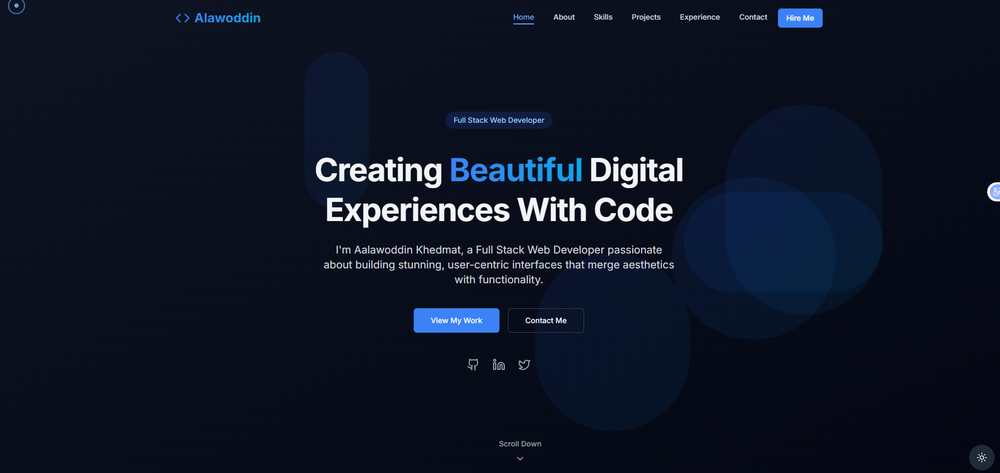
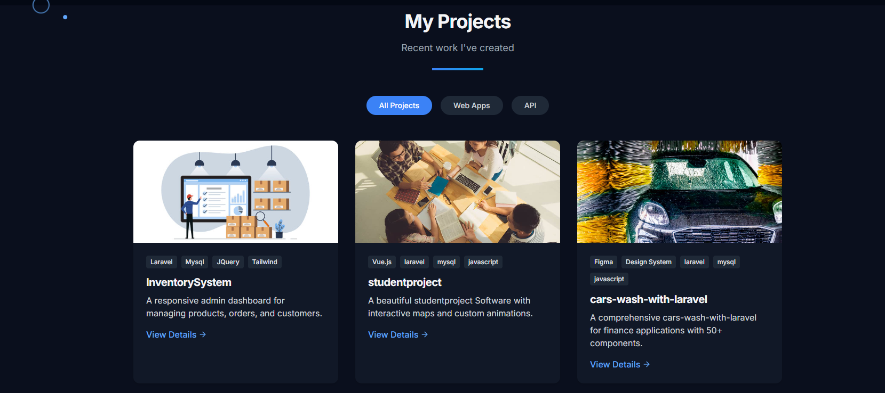
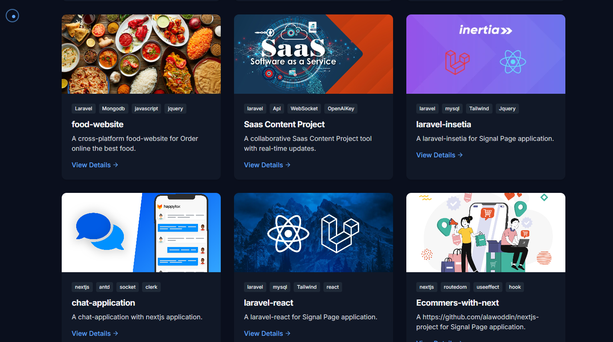
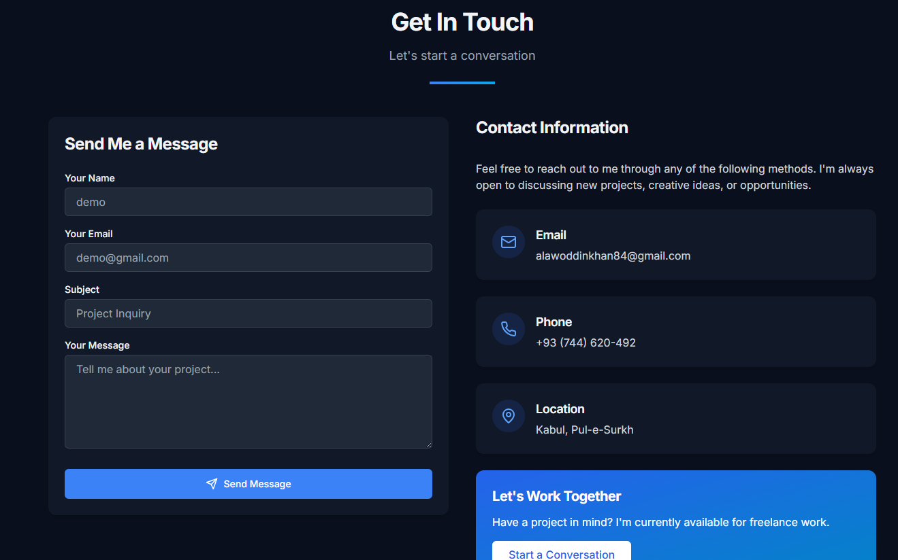

<div align="center">
  <h1>⚛️ Personal Portfolio React</h1>
  <p>Portafolio personal desarrollado en React. Personaliza este archivo con detalles de tu implementación.</p>
</div>

---

## Instalación

1. Entra a la carpeta react:
    ```bash
    cd react
    ```
2. Instala las dependencias:
    ```bash
    npm install
    ```

## Uso

Para desarrollo local:

```bash
npm start
```

---

Agrega aquí detalles sobre estructura, despliegue y personalización de tu portafolio en React.
# 🌐 Personal Portfolio Website

## 📌 Overview

This is a modern and responsive personal portfolio website built with React.js to showcase my projects, skills, and professional experience.

The portfolio highlights my work as a Full-Stack Developer, including SaaS applications, business systems, and API-driven projects.

---

## 🚀 Live Demo

👉 https://khedmat.website/

---

## ✨ Features

* ⚡ Modern and responsive UI design
* 📱 Fully mobile-friendly layout
* 🧑‍💻 Developer portfolio showcase
* 📂 Projects section with details
* 📧 Contact form integration
* 🌙 Clean and user-friendly interface
* ⚡ Fast performance and optimized loading

---

## 🛠 Tech Stack

* **Frontend:** React.js
* **Framework:** (Next.js)
* **Styling:** CSS / Tailwind CSS / Bootstrap
* **Deployment:** (Vercel / Netlify / Hostinger)
* **Version Control:** Git & GitHub

---

## 📷 Screenshots

### 🔹 Inicio Page



### 🔹 Projects Section




### 🔹 Contact Section



---

## 📂 Project Structure

```bash id="p1"
src/
 ├── components/
 ├── pages/
 ├── assets/
 ├── styles/
 └── App.js
```

---

## ⚙️ Installation

### 1️⃣ Clone the repository

```bash id="p2"
git clone https://github.com/alawoddin/my_portfolio_with_react.git
cd portfolio
```

### 2️⃣ Install dependencies

```bash id="p3"
npm install
```

### 3️⃣ Run the project

```bash id="p4"
npm run dev
```

---

## 🎯 Purpose

* Showcase my development skills
* Present real-world projects
* Provide easy contact for clients and recruiters

---

## 👨‍💻 About Me

I am a Full-Stack Developer with experience in Laravel, React, and Next.js, building scalable web applications including SaaS platforms, inventory systems, and student management systems.

---

## 🔗 Connect with Me

* GitHub: https://github.com/alawoddin
* Portfolio: https://khedmat.website/

---

## 📄 License

This project is open-source and available under the MIT License.
